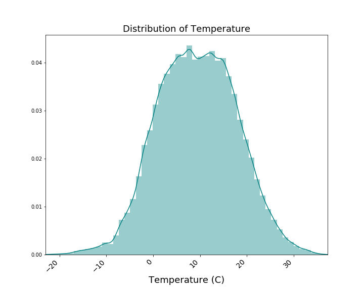
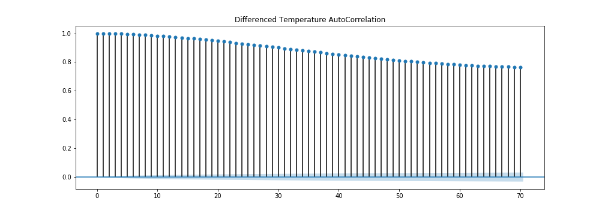

# Building a Time Series Model from Climate Data

## Objectives

Create a time series model using weather data collected from Jena, Germany from 2009-2016, that will allow the user to predict future weather trends. Such predictions could have a major impact on natural disasters, agricultural yield, renewable energy, or even global warming. Once the model is built, it will be tested and evaluated against the 2017 weather data collected from Jena, Germany. 

## The Data

The Training Data:

Collected from [kaggle.com](https://www.kaggle.com/kusuri/jena-climate), the training dataset contains eight years of weather data from Jena, Germany, from 2009-2016, recorded from the Weather Station at the Max Planck Institute for Biogeochemistry. The raw dataset has 420K+ values, taken every 10 minutes, with 15 columns. When building the model, the features were narrowed down to the following: temperature, air pressure, specific humidity, wind velocity.

The Test Data:

Collected from the [origin source](https://www.bgc-jena.mpg.de/wetter/) of the training dataset, the test dataset contains the first 50 weather data points collected in 2017 from Jena, Germany, recorded from the Weather Station at the Max Planck Institute for Biogeochemistry. It has been filtered down to the same features as the training set: temperature, air pressure, specific humidity, and wind velocity.

## Data Analysis

### Down Sampling

### Checking for Trends: Rolling Statistics

### Eliminating Trends: DIfferencing

### Decomposition

### Autocorrelation

### Partial Autocorrelation

## Findings

An ARMA model was created and fit to the weather data from 2009 to 2016 and used to forecast the first 50 weather dta points from 2017. Once predicted, these values were scored against the actual values. The following scores were given for mean absolute error and mean absolute percent error:

Temperature: 
    (+/-) 1.1 C
    (+/-) 16.2%

Air Pressure: 
    (+/-) 1.8 mbar 
    (+/-) 0.2%

Specific Humidity: 
    (+/-) 0.1 g/kg
    (+/-) 7.5%

Wind Velocity: 
    (+/-) 0.7 m/s 
    (+/-) 129.1%
    

## Table of Contents

[Jupyter_Notebook: 2009-2016](time_series_2009_2016.ipynb)

[Jupyter_Notebook: 2017](time_series_test_data_2017.ipynb)

[Blog_Post, Part 1](https://medium.com/@stacyshingleton/building-a-time-series-model-part-1-c3a319c806d4)

[Blog_Post, Part 2](https://medium.com/@stacyshingleton/building-a-time-series-model-part-2-724448eb551d)

[Blog_Post, Part 3]()

