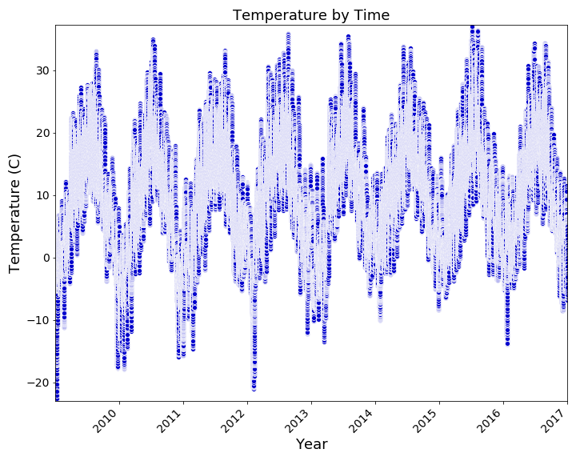
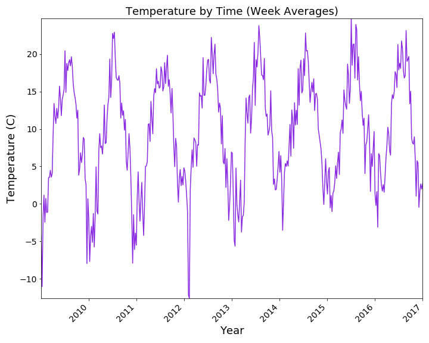
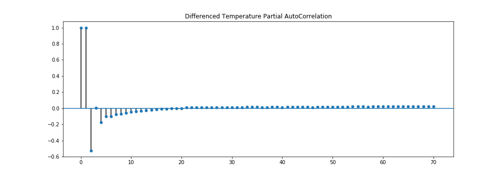

# Building a Time Series Model from Climate Data

## Objectives

Create a time series model using weather data collected from Jena, Germany from 2009-2016, that will allow the user to predict future weather trends. Such predictions could have a major impact on natural disasters, agricultural yield, renewable energy, or even global warming. Once the model is built, it will be tested and evaluated against the 2019 weather data collected from Jena, Germany. 

## The Data

The Training Data:

Collected from [kaggle.com](https://www.kaggle.com/kusuri/jena-climate), the training dataset contains eight years of weather data, from 2009-2016, recorded from the Weather Station at the Max Planck Institute for Biogeochemistry in Jena, Germany. The raw dataset has 420K+ values, with 15 columns, which has been narrowed down to the following features: temperature, air pressure, specific humidity, wind velocity.

The Test Data:

Collected from the [original source](https://www.bgc-jena.mpg.de/wetter/) of the training dataset, the test dataset contains one year of weather data, from 2019, recorded from the Weather Station at the Max Planck Institute for Biogeochemistry in Jena, Germany. It contains the same data as the training set, with just over 50K values.

## Data Analysis

### Down Sampling

### Checking for Trends: Rolling Statistics

### Eliminating Trends: DIfferencing

### Decomposition

### Autocorrelation

### Partial Autocorrelation

## Findings

## Table of Contents

[Jupyter_Notebook: 2009-2016](time_series_2009_2016.ipynb)

[Jupyter_Notebook: 2019](time_series_test_data_2019.ipynb)

[Blog_Post, Part 1](https://medium.com/@stacyshingleton/building-a-time-series-model-part-1-c3a319c806d4)

[Blog_Post, Part 2](https://medium.com/@stacyshingleton/building-a-time-series-model-part-2-724448eb551d)

